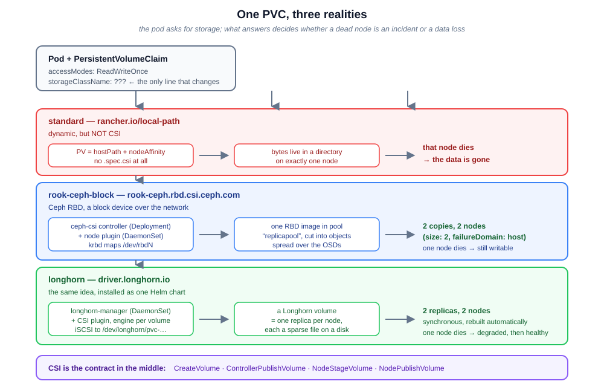

# CSI Storage in Kubernetes — a hands-on course

Every pod that writes a file has already made a storage decision, whether or not
anyone made it on purpose. This course is about that decision: what a
`PersistentVolumeClaim` really is, what a CSI driver does behind the socket, and
what changes when the storage behind a claim is **replicated across nodes**
instead of sitting in a directory on one machine.

It installs both of the storage systems people actually run on Kubernetes —
**Rook Ceph** and **Longhorn** — on one three-node kind cluster, and holds them to
the same tests: a volume a pod formats as ext4, a volume two pods share, a
snapshot both backends take through the *same* CSI API, and a node that dies
underneath a running database.

It is a standalone course: it creates its own kind cluster with its own fake
disks (Lesson 00), installs everything itself, and assumes nothing about the rest
of your machine except Docker, `kind`, `kubectl` and `helm`.

## The lessons (run them in order)

| # | Lesson | What you do |
|---|--------|-------------|
| **00** | [The lab cluster: three nodes and five fake disks](00-cluster-setup/README.md) | kind + loop devices + udev + iscsid: the "hardware" both storage systems need |
| **01** | [PV, PVC, StorageClass, and where CSI plugs in](01-csi-fundamentals/README.md) | static vs dynamic provisioning, then the reference CSI driver, its socket, and a snapshot/restore |
| **02** | [Rook Ceph: block and shared filesystem](02-rook-ceph/README.md) | operator, 2 OSDs on 2 nodes, `HEALTH_OK`, an RBD volume as `/dev/rbd0`, RWX from CephFS |
| **03** | [Longhorn: replicated volumes, and the wall kind puts up](03-longhorn/README.md) | one Helm chart, three replicas on three nodes — and the iSCSI/namespace wall that stops the data plane on kind |
| **04** | [Day-2 operations and Ceph vs Longhorn](04-day2-and-comparison/README.md) | online expansion, the same CSI snapshot on both, killing a node, and choosing between them |



> The diagram is the mental model for the whole course: the pod only ever names a
> PVC. Whether that claim becomes a directory on one node, an RBD image replicated
> across two OSDs, or three synchronous replicas of a sparse file is decided by
> one line — `storageClassName` — and everything after that is the driver's
> business.

## Requirements

| Tool | Why |
|------|-----|
| **Docker** + ~8GB of RAM free | each kind "node" is a container; Ceph and Longhorn together are real daemons |
| **kind** ≥ v0.31, **kubectl** (verified on v1.36.4), **helm** ≥ v3.13, **git** | the cluster and the storage systems |
| **Internet access** | node images, Ceph (~1GB), Longhorn, and the CSI sidecars |
| **A disposable machine** | Lesson 00 gives Rook access to device nodes. It is fenced in by naming one device per node, but do not run this on a machine whose disks you cannot afford to lose |

No GPU is needed. Linux is assumed (the lab reaches into Docker and, in Lesson
04, stops a node container); macOS and Windows users would need a Linux VM.

## How to run the course

```bash
cd 00-cluster-setup
kind create cluster --config kind-config.yaml
./prepare-disks.sh
```

Then follow the lessons in order. Each one cleans up after itself
(`kubectl delete namespace ...`), and `./cleanup.sh` at the end tears down
everything, in the order that matters.

> 💡 **Tip:** if you keep other kind clusters, add
> `--kubeconfig ~/.kube/csilab.yaml` to `kind create` and export `KUBECONFIG` —
> that is how this course was recorded, so a stray `kubectl delete` cannot land on
> your other clusters.

## What you end up with

| Lesson | StorageClass | Provisioner | Backing it up | Survives a node dying |
|--------|--------------|-------------|---------------|-----------------------|
| 01 | `standard` | `rancher.io/local-path` | `hostPath` on one node | no |
| 01 | `csi-hostpath-sc` | `hostpath.csi.k8s.io` | a directory on one node | no |
| 02 | `rook-ceph-block` | `rook-ceph.rbd.csi.ceph.com` | RBD image, 2 copies on 2 OSDs | **yes, verified** — read a volume with half its replicas gone |
| 02 | `rook-cephfs` | `rook-ceph.cephfs.csi.ceph.com` | CephFS, 2 copies, shared | yes (same pool) |
| 03 | `longhorn` | `driver.longhorn.io` | 3 replicas placed on 3 nodes | not on kind — see below |

The point of the table is the middle column: **`local-path` is dynamic and not
CSI; `hostpath` is CSI and not replicated.** CSI is a protocol, not a promise
about your data.

One row needs a caveat rather than a checkmark. Longhorn's control plane works
perfectly here — it created the volume and placed **three replicas on three
different nodes** — but its V1 data plane cannot attach a volume inside a kind
node, because the engine logs into its own iSCSI target through a live `iscsid`
process's namespaces and that cannot survive kind's nested PID namespace. Lesson
03 has the full diagnosis and the two states that both fail. The honest summary:
**on kind, Ceph's kernel-RBD data path works and Longhorn's userspace iSCSI path
does not** — which is also why Longhorn does not list kind as a supported
platform.

## Cleanup

```bash
./cleanup.sh
```

It is idempotent, and it detaches the loop devices **before** deleting the
cluster — deleting a kind node while a loop device is attached to a file inside
it leaves the host kernel holding a device whose backing file no longer exists.

## Is this production?

The drivers, the CRDs, the StorageClasses and the failure modes are the real
ones — this is Rook v1.20.7 with Ceph Tentacle v20.2.4, and Longhorn v1.12.1 on
Kubernetes v1.35.0. Four honest caveats, each developed in the lessons:

- **The disks are loop devices.** They cannot fail like disks, and every
  throughput number you could measure is meaningless. The course publishes none.
- **Longhorn does not officially support kind, and this course found out why.**
  No maintainer statement of support, and it is absent from their CI. It installs
  and manages disks and replicas correctly here — because kind ≥ v0.20.0 ships
  `open-iscsi` and `nfs-common` in the node image and shares the host kernel, and
  because Lesson 00 gives each node an ext4 data path, which this workstation's
  btrfs root would not otherwise provide — but attaching a volume requires
  `iscsid` to live in the node's namespaces, which kind's container-in-container
  design does not allow. Lesson 03 documents both failing states with the real
  error messages instead of hiding them.
- **The host's real disks are visible to the storage system.** A privileged kind
  node gets the host's device nodes, so Rook's OSD discovery inventories your
  actual NVMe (you can see it being skipped in Lesson 02's logs). Naming one
  device per node is what keeps that from mattering; `useAllDevices: true` on a
  machine whose disk looked empty would have wiped it.
- **One node is not a failure domain.** Two kind workers give a real cross-node
  story; they do not give you a rack, a zone, or a maintenance window.
- **Muting is not fixing.** Where a warning is silenced (Ceph's cephx key-type
  warnings), the lesson shows it firing first and explains why the mute is
  acceptable — and `ceph status` keeps printing `(muted: ...)` so it never
  disappears.
